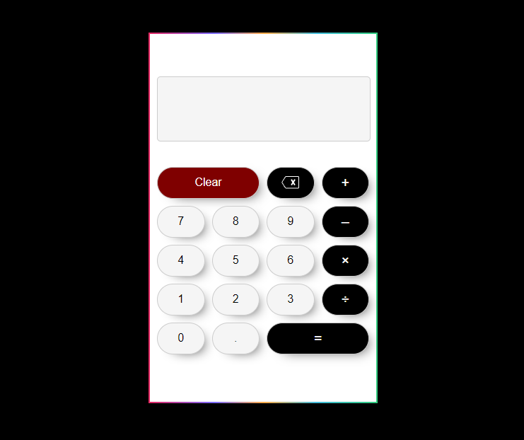

# Calculadora em React

Este é um projeto de uma calculadora simples desenvolvida em React.

## Funcionalidades

- Adição, subtração, multiplicação e divisão de números.
- Exibição do resultado em tempo real.

## Tecnologias utilizadas

- HTML
- CSS
- JavaScript
- React

## Pré-requisitos

Antes de executar o projeto, você deve ter os seguintes pacotes instalado em seu ambiente:

- Node.js
- npm (Node Package Manager) ou Yarn

## Como executar o projeto localmente

1. Faça um clone deste repositório para o seu computador;
2. Navegue até o diretório do projeto;
3. Instale as dependências do projeto (npm install ou yarn install);
4. Inicie o servidor de desenvolvimento (npm start ou yarn start);
5. Abra o navegador e acesse a URL [http://localhost:3000](http://localhost:3000) para visualizar a calculadora.

## Como vizualizar o projeto em produção

1.  Abra o navegador e acesse a URL [https://desafio-infracommerce.vercel.app/](https://desafio-infracommerce.vercel.app/).

